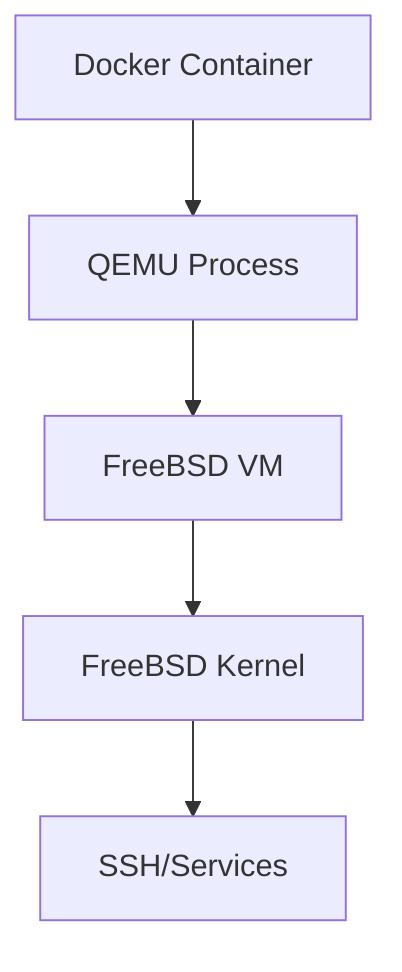

# FreeBSD Docker Image

Run FreeBSD in Docker using QEMU virtualization.

## Quick Start

```bash
# Run FreeBSD
docker run -it --rm --privileged aygp-dr/freebsd:14.0-RELEASE

# With SSH access
docker run -d --privileged -p 2222:22 aygp-dr/freebsd:14.0-RELEASE
ssh -p 2222 root@localhost  # password: freebsd
```

## Building

```bash
make build
make run
```

## Architecture



## License

MIT
