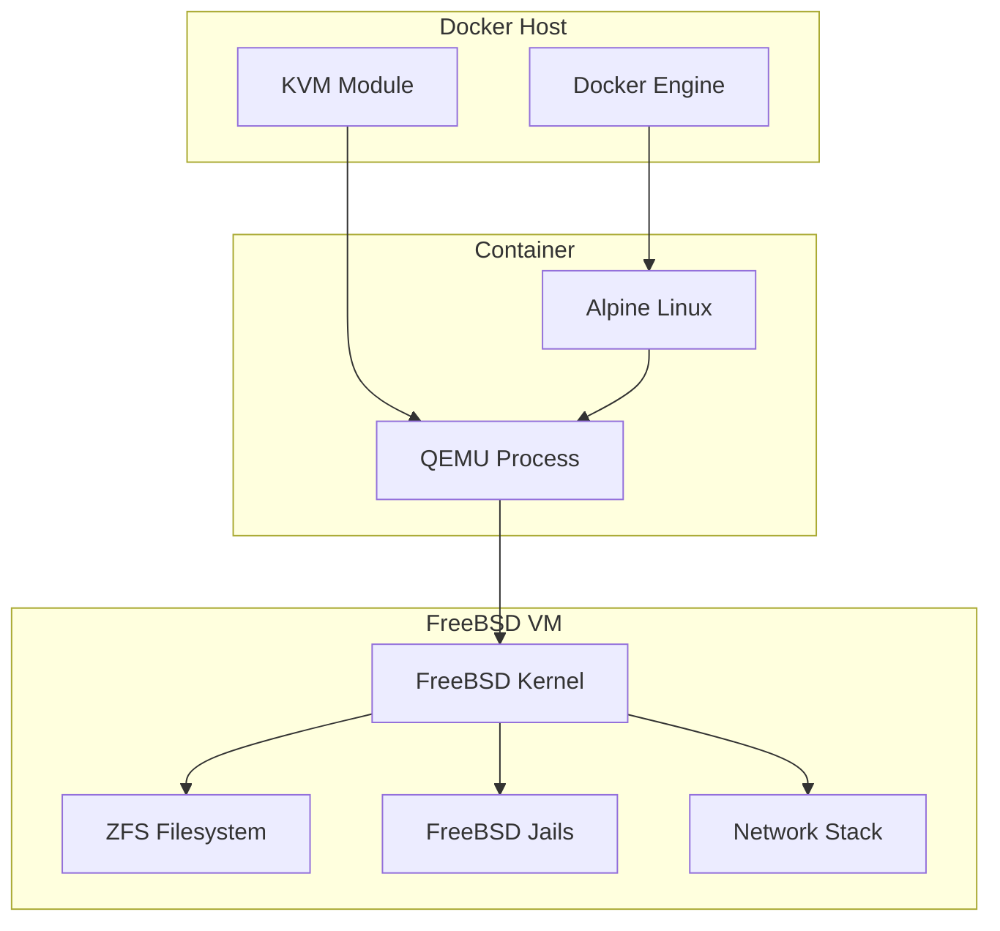

# FreeBSD Docker Image

[](https://github.com/aygp-dr/freebsd-docker/actions/workflows/docker-publish.yml)
[](https://github.com/aygp-dr/freebsd-docker/actions/workflows/docker-validate.yml)
[](https://www.freebsd.org/)
[](https://github.com/aygp-dr/freebsd-docker/blob/main/LICENSE)
[](https://github.com/aygp-dr/freebsd-docker)

[](https://hub.docker.com/r/aygpdr/freebsd)
[](https://hub.docker.com/r/aygpdr/freebsd/tags)
[](https://hub.docker.com/r/aygpdr/freebsd)

Run FreeBSD virtual machines in Docker containers with QEMU, including support for jails, ZFS, and advanced networking.

> **🚀 Quick Start**: Images available at `docker.io/aygpdr/freebsd`.

> **⚠️ Known Issues**: 
> - Build times are currently 30+ minutes due to FreeBSD installation during build (see [#4](https://github.com/aygp-dr/freebsd-docker/issues/4))
> - GHCR publishing requires permission fix (see [GHCR_SETUP.md](GHCR_SETUP.md))
> - Apple Silicon Macs require `--platform linux/amd64` (see [#3](https://github.com/aygp-dr/freebsd-docker/issues/3))

## Features

- 🐡 FreeBSD 14.2-RELEASE (stable)
- 🚀 KVM acceleration support
- 🔒 FreeBSD jails management
- 💾 ZFS filesystem support
- 🌐 Advanced networking (bridge/NAT)
- 📦 Docker Compose orchestration
- 🖥️ Optional VNC access
- 🔧 Automated installation

## Quick Start

```bash
# Pull from Docker Hub
docker pull aygpdr/freebsd:latest

# Simple run (Alpine container with QEMU)
docker run -it --rm --privileged aygpdr/freebsd:latest

# With SSH access (SSH into FreeBSD VM inside container)
docker run -d --privileged -p 2222:22 aygpdr/freebsd:latest
# Wait for FreeBSD to boot (60-90 seconds)
ssh -p 2222 root@localhost  # password: freebsd

# For Apple Silicon Macs (ARM64)
docker run -d --platform linux/amd64 --privileged -p 2222:22 aygpdr/freebsd:latest

# Using Docker Compose
docker-compose up -d
docker-compose exec freebsd ssh
```

### Cloud Deployments

Comprehensive cloud deployment guides are available in [`CLOUD_CONFIG.md`](CLOUD_CONFIG.md):
- **AWS**: EC2, ECS, EKS deployments with auto-scaling
- **Google Cloud**: Compute Engine, GKE, Cloud Run
- **Replit**: Full integration with Replit environment (see Replit section in [`CLOUD_CONFIG.md`](CLOUD_CONFIG.md))
- **Azure**: Container Instances, AKS
- **DigitalOcean**: Droplets, DOKS

## Building

Using the included [`Makefile`](Makefile):

```bash
# Show help (default target)
gmake

# Complete build pipeline
gmake all

# Individual targets
gmake build    # Build image
gmake run      # Run container
gmake audit    # Analyze size and security
gmake push     # Push to registry
```

See [`Makefile`](Makefile) for all available targets.

## Advanced Usage

### Full Development Stack

Use [`docker-compose.full.yml`](docker-compose.full.yml) for complete stack:

```bash
gmake compose-up    # Start all services
gmake compose-logs  # View logs
gmake compose-down  # Stop all services
```

### Environment Configuration

Copy [`.env.example`](.env.example) to `.env` and customize:

```bash
cp .env.example .env
# Edit .env with your settings
docker-compose up -d
```

### Jail Management

```bash
# Create a jail
docker-compose exec freebsd jail create myjail

# Start jail
docker-compose exec freebsd jail start myjail

# Execute commands in jail
docker-compose exec freebsd jail exec myjail pkg install nginx

# List jails
docker-compose exec freebsd jail list
```

### ZFS Configuration

```bash
# Initialize ZFS with additional disk
ZFS_DISK=10G docker-compose up -d

# Setup ZFS pools
docker-compose exec freebsd zfs init

# Check ZFS status
docker-compose exec freebsd zfs status

# Create snapshots
docker-compose exec freebsd zfs snapshot zroot/data backup1
```

### Bridge Networking

```bash
# Enable bridge networking
ENABLE_BRIDGE=true NETWORK_MODE=bridge docker-compose up -d
```

### VNC Access

```bash
# Enable VNC
ENABLE_VNC=true docker-compose up -d

# Connect with VNC client to localhost:5900
```

## Architecture



## Scripts

All scripts are located in the [`scripts/`](scripts/) directory:

- [`entrypoint.sh`](scripts/entrypoint.sh) - Main container entrypoint with multiple operation modes
- [`install-freebsd.sh`](scripts/install-freebsd.sh) - Automated FreeBSD installation
- [`jail-manager.sh`](scripts/jail-manager.sh) - Jail creation and management
- [`zfs-setup.sh`](scripts/zfs-setup.sh) - ZFS pool and dataset configuration  
- [`network-setup.sh`](scripts/network-setup.sh) - Advanced networking setup
- [`health-check.sh`](scripts/health-check.sh) - Container health monitoring
- [`install-dev-tools.sh`](scripts/install-dev-tools.sh) - Install comprehensive development tools

## Requirements

- Docker 20.10+
- Docker Compose 2.0+
- 4GB RAM minimum (2GB for VM)
- 20GB free disk space
- KVM support (optional, for acceleration)

## Configuration Options

| Variable | Default | Description |
|----------|---------|-------------|
| `MEMORY` | `2G` | VM memory allocation |
| `CPUS` | `2` | Number of CPU cores |
| `DISK_SIZE` | `10G` | Primary disk size |
| `ZFS_DISK` | - | Additional ZFS disk size |
| `NETWORK_MODE` | `user` | Network mode (user/bridge/none) |
| `ENABLE_VNC` | `false` | Enable VNC access |
| `ENABLE_BRIDGE` | `false` | Enable bridge networking |
| `SSH_PORT` | `22` | SSH port mapping |

## Troubleshooting

### Understanding the Architecture

This container runs FreeBSD inside QEMU inside Alpine Linux:
```
Host OS → Docker → Alpine Linux → QEMU → FreeBSD VM
```

When you first run the container, you'll be in the Alpine shell. FreeBSD runs inside QEMU within this container. Access FreeBSD via SSH on port 22 (mapped to 2222 on host).

### No KVM Acceleration

If running without KVM:
```bash
# Check if KVM is available
ls /dev/kvm

# Run without KVM (slower)
docker run --rm -it aygpdr/freebsd:latest
```

### Apple Silicon (M1/M2/M3) Macs

Use platform override for x86_64 emulation:
```bash
docker pull --platform linux/amd64 aygpdr/freebsd:latest
docker run -d --platform linux/amd64 --privileged -p 2222:22 aygpdr/freebsd:latest
```
See [run-on-arm64-mac.sh](run-on-arm64-mac.sh) for automated setup.

### Network Issues

For bridge networking, ensure Docker has necessary permissions:
```bash
docker run --cap-add=NET_ADMIN --privileged ...
```

### Disk Space

Monitor disk usage:
```bash
docker-compose exec freebsd df -h
docker-compose exec freebsd zfs list
```

## License

BSD 3-Clause License
