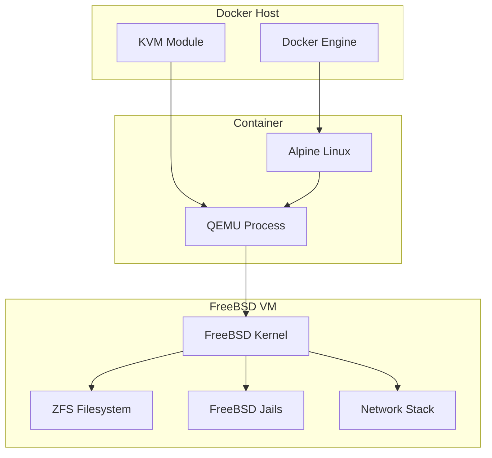

# FreeBSD Docker Image

[](https://github.com/aygp-dr/freebsd-docker/actions)
[](https://hub.docker.com/r/aygp-dr/freebsd)
[](https://hub.docker.com/r/aygp-dr/freebsd/tags)
[](https://hub.docker.com/r/aygp-dr/freebsd)
[](https://www.freebsd.org/)
[](https://github.com/aygp-dr/freebsd-docker/blob/main/LICENSE)

Run FreeBSD virtual machines in Docker containers with QEMU, including support for jails, ZFS, and advanced networking.

## Features

- 🐡 FreeBSD 14.0-RELEASE (configurable)
- 🚀 KVM acceleration support
- 🔒 FreeBSD jails management
- 💾 ZFS filesystem support
- 🌐 Advanced networking (bridge/NAT)
- 📦 Docker Compose orchestration
- 🖥️ Optional VNC access
- 🔧 Automated installation

## Quick Start

```bash
# Simple run
docker run -it --rm --privileged aygp-dr/freebsd:14.0-RELEASE

# With SSH access
docker run -d --privileged -p 2222:22 aygp-dr/freebsd:14.0-RELEASE
ssh -p 2222 root@localhost  # password: freebsd

# Using Docker Compose
docker-compose up -d
docker-compose exec freebsd ssh
```

## Building

```bash
# Build image
make build

# Run container
make run

# Push to registry
make push
```

## Advanced Usage

### Environment Configuration

Copy `.env.example` to `.env` and customize:

```bash
cp .env.example .env
# Edit .env with your settings
docker-compose up -d
```

### Jail Management

```bash
# Create a jail
docker-compose exec freebsd jail create myjail

# Start jail
docker-compose exec freebsd jail start myjail

# Execute commands in jail
docker-compose exec freebsd jail exec myjail pkg install nginx

# List jails
docker-compose exec freebsd jail list
```

### ZFS Configuration

```bash
# Initialize ZFS with additional disk
ZFS_DISK=10G docker-compose up -d

# Setup ZFS pools
docker-compose exec freebsd zfs init

# Check ZFS status
docker-compose exec freebsd zfs status

# Create snapshots
docker-compose exec freebsd zfs snapshot zroot/data backup1
```

### Bridge Networking

```bash
# Enable bridge networking
ENABLE_BRIDGE=true NETWORK_MODE=bridge docker-compose up -d
```

### VNC Access

```bash
# Enable VNC
ENABLE_VNC=true docker-compose up -d

# Connect with VNC client to localhost:5900
```

## Architecture



## Scripts

- `entrypoint.sh` - Main container entrypoint
- `install-freebsd.sh` - Automated FreeBSD installation
- `jail-manager.sh` - Jail creation and management
- `zfs-setup.sh` - ZFS pool and dataset configuration
- `network-setup.sh` - Advanced networking setup
- `health-check.sh` - Container health monitoring

## Requirements

- Docker 20.10+
- Docker Compose 2.0+
- 4GB RAM minimum (2GB for VM)
- 20GB free disk space
- KVM support (optional, for acceleration)

## Configuration Options

| Variable | Default | Description |
|----------|---------|-------------|
| `MEMORY` | `2G` | VM memory allocation |
| `CPUS` | `2` | Number of CPU cores |
| `DISK_SIZE` | `10G` | Primary disk size |
| `ZFS_DISK` | - | Additional ZFS disk size |
| `NETWORK_MODE` | `user` | Network mode (user/bridge/none) |
| `ENABLE_VNC` | `false` | Enable VNC access |
| `ENABLE_BRIDGE` | `false` | Enable bridge networking |
| `SSH_PORT` | `22` | SSH port mapping |

## Troubleshooting

### No KVM Acceleration

If running without KVM:
```bash
# Check if KVM is available
ls /dev/kvm

# Run without KVM (slower)
docker run --rm -it aygp-dr/freebsd:14.0-RELEASE
```

### Network Issues

For bridge networking, ensure Docker has necessary permissions:
```bash
docker run --cap-add=NET_ADMIN --privileged ...
```

### Disk Space

Monitor disk usage:
```bash
docker-compose exec freebsd df -h
docker-compose exec freebsd zfs list
```

## License

BSD 3-Clause License
