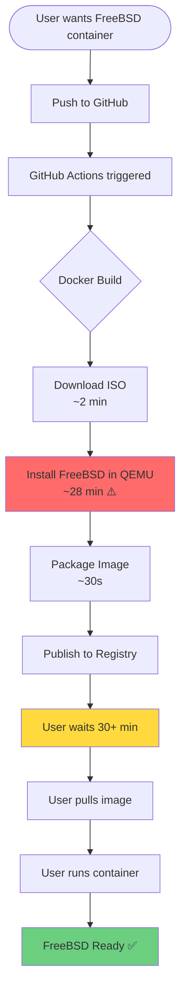
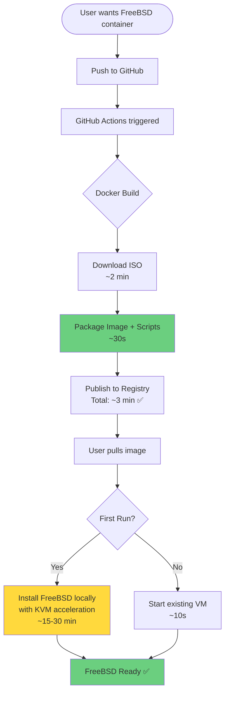
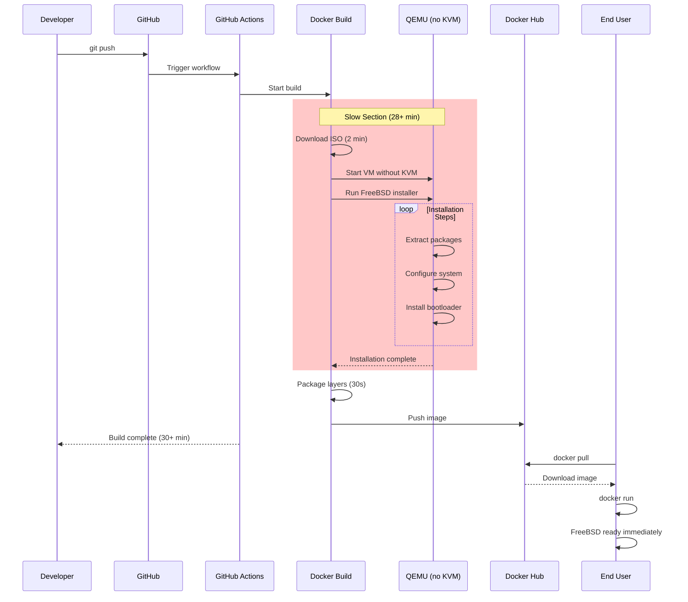
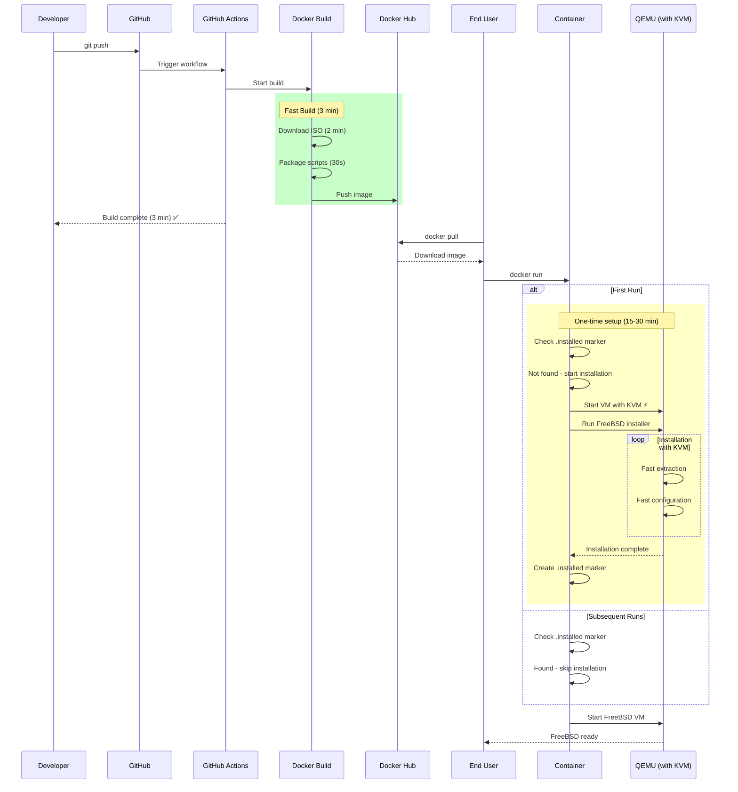
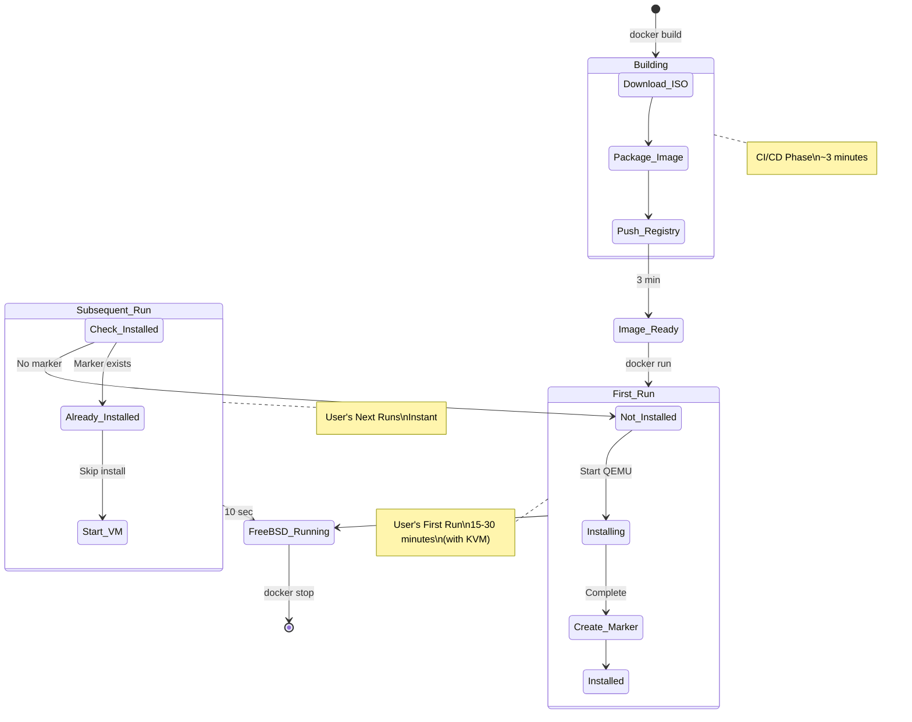
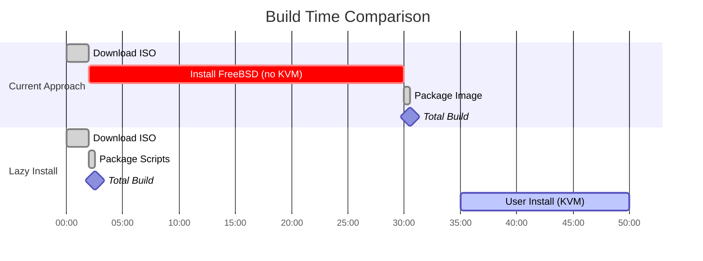
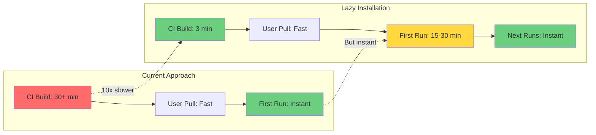

# Architecture Diagrams: Current vs Lazy Installation

## User Flow Diagram

### Current Approach (Install During Build)

### Lazy Installation Approach (Install on First Run)

## Sequence Diagram: Current Approach

## Sequence Diagram: Lazy Installation Approach

## State Diagram: Container Lifecycle

## Performance Comparison

## Decision Matrix

## Key Insights

1. **CI/CD Wins**: 10x faster builds (3 min vs 30+ min)
2. **User Trade-off**: First run slower, but with KVM acceleration
3. **Resource Usage**: GitHub Actions minutes saved significantly
4. **Cache Benefits**: ISO download layer can be cached effectively